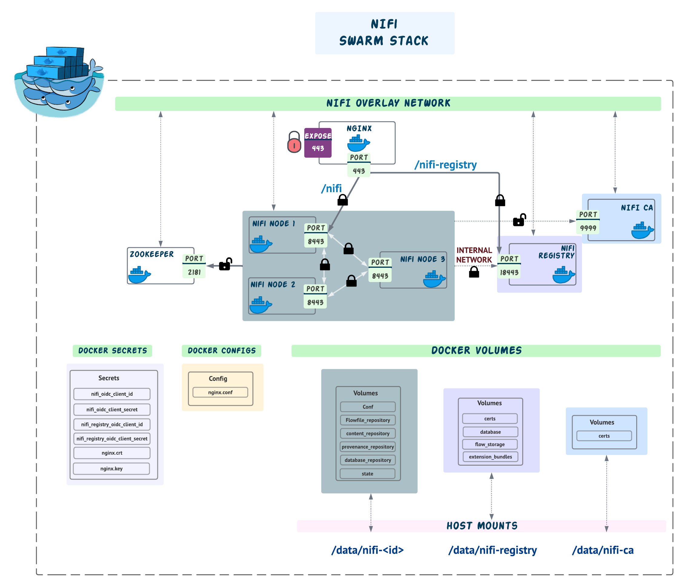

# NiFi Stack

### Stack overview

* Zookeeper
* NiFi Node 1, 2 & 3
* NiFi Certificate Authority (CA)
* NiFi Registry
* Nginx

## Prerequisites
* Install [Docker](https://www.docker.com/)
* Install [Docker Compose](https://docs.docker.com/compose/install/)

### Design


## Custom NiFi Docker
NiFi docker container is a customization from the [official Apache Nifi Docker Image](https://hub.docker.com/r/apache/nifi) to further extend support for OpenID Connect (OIDC) Authentication mechanism, allow configuration files to scale for dynamic nodes and embedded nifi tls toolkit binary running in client mode for node certificate generation.

### 1. Build Docker
Switch to `nifi` directory
```bash
$ cd nifi
$ docker build -t custom-nifi .
```

## Custom NiFi Registry
NiFi Registry docker container is a customization from the [official Apache Nifi Registry Docker Image](https://hub.docker.com/r/apache/nifi-registry) to further extend support for OpenID Connect (OIDC) Authentication mechanism and embedded nifi tls toolkit binary running in client mode for node certificate generation.

### 1. Build Docker
Switch to `nifi-registry` directory
```bash
$ cd nifi-registry
$ docker build -t custom-registry .
```

## Custom NiFi CA Docker
NiFi CA docker container is a customization from the [official Apache Nifi Toolkit Docker Image](https://hub.docker.com/r/apache/nifi-toolkit).
NiFi Cluster today relies on NiFi TLS-Toolkit to issue keystores,truststores and security populated configuration files which makes the certificate generation much easier and can scale to any number of on-demand nodes to avoid tedious and error-prone process. All NiFi nodes will have embedded NiFi CA client (running NiFi Toolkit in client mode) to request for node certificate from independent NiFi CA Sever (running NiFi Toolkit in server mode). The client will issue Certificate Signing Requests (CSR) to Server which then signs them. This happens by enabling both client and server to validate each other's identity through a shared secert allowing mutual TLS communication between nodes and to external applications without needing to trust each other first.

### 1. Build Docker
Switch to `nifi-ca` directory
```bash
$ cd nifi-ca
$ docker build -t custom-toolkit .
```

## Deploy NiFi Stack
### Usage (Development)
To try this stack out-of-the-box, you need a local `.env` where environment variables are specified which will be available to containers

```bash
# Pre-install changes, this will perform necessary instructions to run our compose services 
$ ./compose-run.sh
# Start the Docker Compose service
$ docker-compose up
```

```bash
# Check if all containers are up and running
$ docker ps
```

### Usage (Production)
For Production, you must leverage docker swarm mode which orchestrate and managed the stack. To try this stack, simply run

```bash
# Pre-install changes, this will perform necessary instructions to run our swarm services such as creating secrets
$ ./swarm-run.sh
# Start the Docker Swarm service
$ docker stack deploy -c docker-swarm.yml nifi-stack
```

```bash
# Check if all services are up and running
$ docker service ls
ID             NAME                       MODE         REPLICAS   IMAGE                         PORTS
m0qo6oj54k5i   nifi-stack_init-service    replicated   0/1        busybox:latest
ix29qu4c8vmc   nifi-stack_nginx           replicated   1/1        nginx:1.21.6                  *:80->80/tcp, *:443->443/tcp
oraxq4ha2d7w   nifi-stack_nifi-1          replicated   1/1        custom-nifi:latest            *:30006->8443/tcp
zdtoff9h07my   nifi-stack_nifi-2          replicated   1/1        custom-nifi:latest            *:30007->8443/tcp
jp0ac4jhn6vy   nifi-stack_nifi-3          replicated   1/1        custom-nifi:latest            *:30008->8443/tcp
9bvsuohrsy03   nifi-stack_nifi-ca         replicated   1/1        custom-toolkit:latest         *:30009->9999/tcp
lv7uevazcyty   nifi-stack_nifi-registry   replicated   1/1        apache/nifi-registry:1.15.3   *:18080->18080/tcp
t2hbu9984rkx   nifi-stack_zookeeper       replicated   1/1        zookeeper:3.6.2               *:30005->2181/tcp
```

After deploying the stack, you should have access to the UI
- NiFi: `https://localhost/nifi/`
- NiFi Registry: `http://localhost/nifi-registry/`


## References

- [How to start using NiFi](https://nifi.apache.org/docs/nifi-docs/html/administration-guide.html#how-to-install-and-start-nifi)
- [How to start using NiFi Registry](https://nifi.apache.org/docs/nifi-registry-docs/html/administration-guide.html#how-to-install-and-start-nifi-registry)